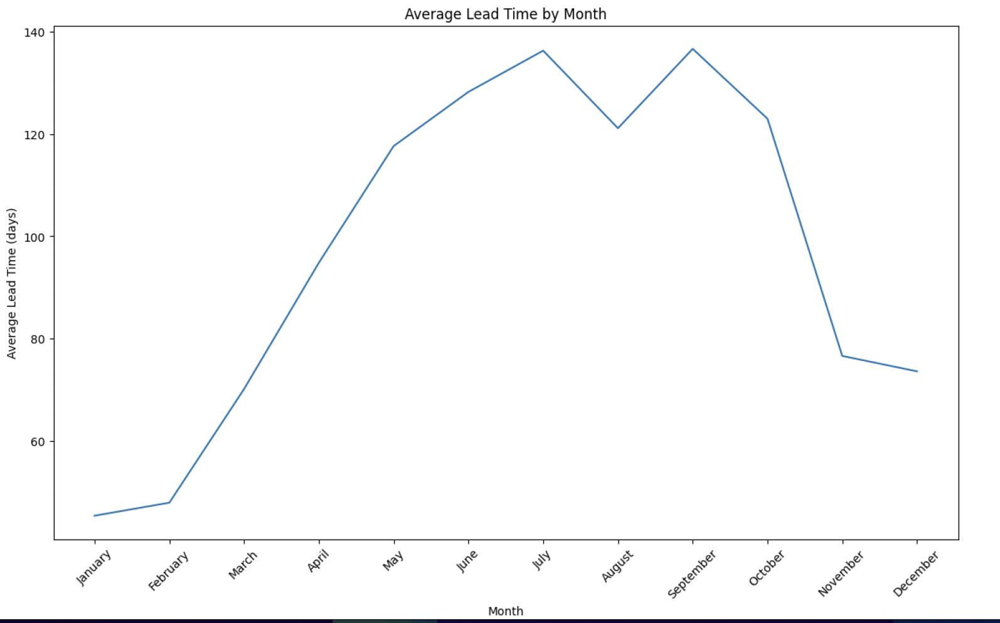
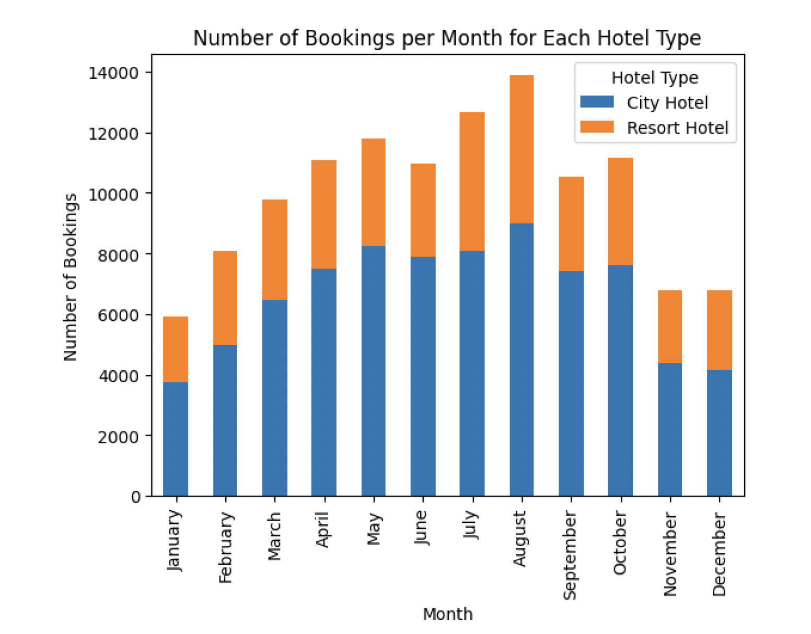
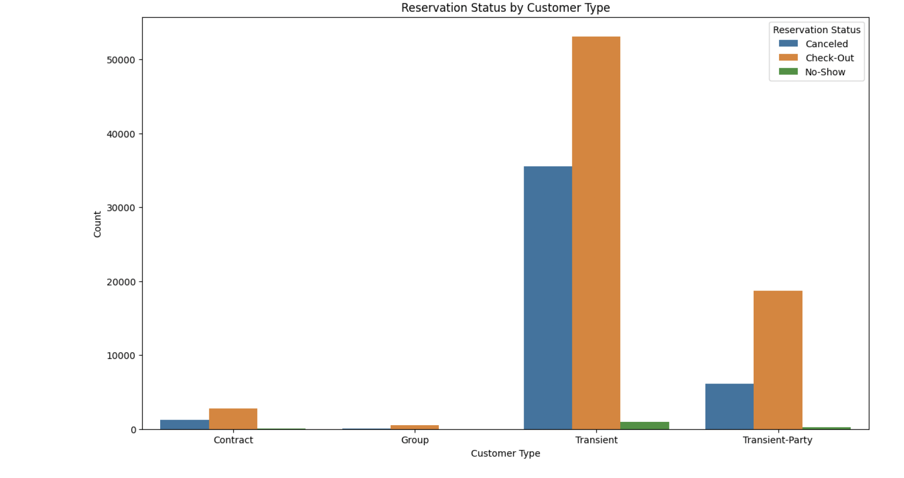
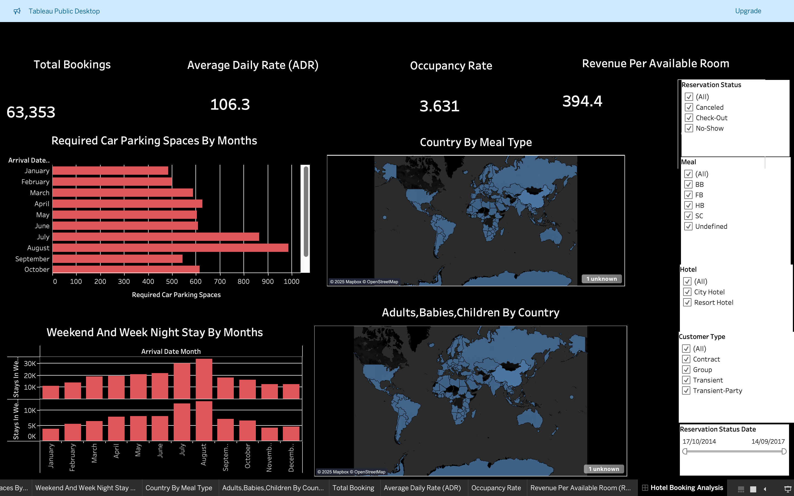

# Hotel Booking Analysis – Guest Behavior & Booking Trends

## Project Overview
This project analyzes hotel booking data to understand **seasonality, customer behavior, cancellations, and key revenue KPIs**.  
The objective is to extract **actionable insights** to support pricing strategy, capacity planning, and operational decision-making in the hospitality domain.

---

## Dataset
- **Source**: Hotel Booking Demand dataset  
- **Total Records**: ~63,000 bookings  
- **Hotel Types**: City Hotel, Resort Hotel  

---

## Business Questions Addressed
- How does booking lead time vary across months and seasons?
- What are the monthly booking patterns for City vs Resort hotels?
- Which customer segments contribute most to cancellations?
- How do key KPIs (ADR, Occupancy, RevPAR) behave during peak periods?

---

## Exploratory Data Analysis (EDA)

### 1. Average Lead Time by Month

**Insight**  
Booking lead time increases significantly from spring to late summer, peaking between **July and September**, indicating early planning during high-demand periods.

---

### 2. Monthly Booking Trend by Hotel Type

**Insight**  
City hotels consistently generate higher booking volumes. Both hotel types show strong seasonality with peak demand during **summer months**.

---

### 3. Reservation Status by Customer Type

**Insight**  
Transient customers account for the majority of cancellations, while contract and group customers show higher booking reliability.

---

## Tableau Dashboard
An interactive Tableau dashboard was built to track **key hospitality KPIs and operational metrics**.

### Dashboard Highlights
- **Total Bookings**: 63,353  
- **Average Daily Rate (ADR)**: 106.3  
- **Occupancy Rate**
- **Revenue Per Available Room (RevPAR)**: 394.4  
- Monthly parking demand trends  
- Geographic distribution of guests  
- Interactive filters by hotel type, customer type, meal plan, and reservation status  

🔗 **Tableau Public Dashboard**: *https://public.tableau.com/views/HotelBookingAnalysis_17215875929250/HotelBookingAnalysis?:language=en-GB&:sid=&:redirect=auth&:display_count=n&:origin=viz_share_link*

---

## Tools & Technologies
- **Python**: Pandas, NumPy, Matplotlib
- **Jupyter Notebook**: Exploratory analysis
- **Tableau**: Interactive dashboard and KPI visualization
- **GitHub**: Version control and documentation

---

## Business Impact
- Identified peak booking months to support **capacity and pricing strategy**
- Highlighted high-cancellation customer segments for **policy optimization**
- Enabled **dashboard-driven performance monitoring** for management
